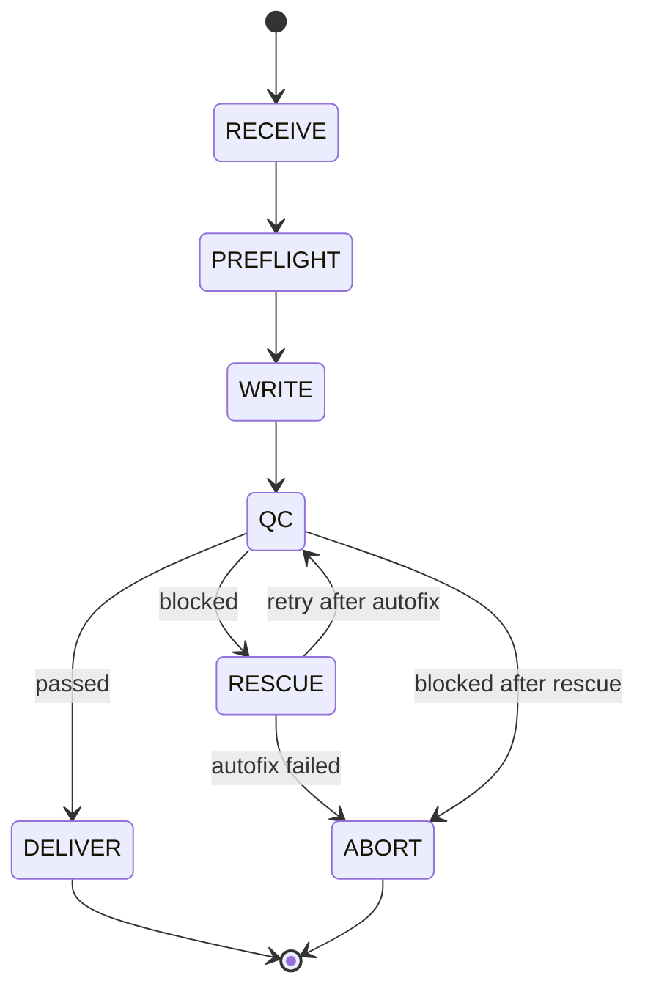

# PR #20 - Gemini Documentation Review Fixes

**Status:** PR already merged - Apply fixes to current documentation
**Priority:** Medium - Documentation inconsistencies (no code bugs)
**Estimated time:** 20-30 minutes

---

## Summary

Gemini identified 7 documentation inconsistencies in PR #20 (BACOWR Documentation Expansion):
- Pagination inconsistency (cursor vs offset examples)
- Authentication confusion (API keys vs JWT in examples)
- Missing schema fields
- Architecture diagram conflicts
- Stale/duplicate roadmap entries

All issues are **documentation-only** - no code changes needed.

---

## 🟡 MEDIUM PRIORITY FIXES

### Fix 1: Pagination Inconsistency

**File:** `docs/architecture/api_reference.md`
**Problem:** Docs describe cursor-based pagination but examples use offset-based

**Find sections with:**
```markdown
# Pagination (current - inconsistent)
Using cursor-based pagination for large result sets...

Example:
GET /api/v1/jobs?limit=20&offset=40
```

**Fix - Option A (Use offset consistently):**
```markdown
# Pagination
Using offset-based pagination for result sets.

Parameters:
- `limit` (integer): Number of items per page (default: 20, max: 100)
- `offset` (integer): Number of items to skip (default: 0)

Example:
GET /api/v1/jobs?limit=20&offset=40

Response:
{
  "items": [...],
  "pagination": {
    "total": 150,
    "limit": 20,
    "offset": 40,
    "has_more": true
  }
}
```

**Fix - Option B (Use cursor consistently):**
```markdown
# Pagination
Using cursor-based pagination for efficient navigation of large result sets.

Parameters:
- `limit` (integer): Number of items per page (default: 20, max: 100)
- `cursor` (string): Opaque cursor for next page (optional)

Example:
GET /api/v1/jobs?limit=20&cursor=eyJpZCI6MTIzNH0

Response:
{
  "items": [...],
  "pagination": {
    "next_cursor": "eyJpZCI6MTI1NH0",
    "has_more": true
  }
}
```

**Recommendation:** Option A (offset) - simpler, matches current API implementation

---

### Fix 2: Authentication Examples Inconsistency

**File:** `docs/architecture/api_reference.md`
**Problem:** SDK examples use legacy API keys despite docs promoting JWT as standard

**Current (inconsistent):**
```markdown
## Authentication
BACOWR uses JWT tokens for authentication (recommended).

Example (Python SDK):
import bacowr
client = bacowr.Client(api_key="bacowr_...")  # Legacy API key!
```

**Fixed:**
```markdown
## Authentication

### JWT Tokens (Recommended)
Production applications should use JWT tokens for secure, time-limited access.

Example (Python SDK):
```python
import bacowr

# Using JWT token (recommended)
client = bacowr.Client(token="eyJhbGciOiJIUzI1...")

# Using legacy API key (deprecated, for backward compatibility)
client = bacowr.Client(api_key="bacowr_...")
```

### API Keys (Legacy)
API keys are supported for backward compatibility but will be deprecated in v2.0.

Example:
```bash
curl -H "X-API-Key: bacowr_..." https://api.bacowr.com/v1/jobs
```

We recommend migrating to JWT tokens. See [Authentication Migration Guide](./auth_migration.md).
```

**Also add note in all SDK examples:**
```python
# Note: This example uses JWT tokens (recommended).
# For API key usage, see legacy documentation.
```

---

### Fix 3: Missing Schema Field

**File:** `docs/architecture/api_reference.md`
**Problem:** `idempotency_key` mentioned in best practices but missing from schema

**Find the Job Create Request schema and add:**
```markdown
### POST /api/v1/jobs - Request Schema

```json
{
  "publisher_domain": "string (required)",
  "target_url": "string (required, must be valid URL)",
  "anchor_text": "string (required, 1-500 chars)",
  "anchor_type": "string (optional: exact|partial|brand|generic)",
  "min_word_count": "integer (optional, default: 900, range: 500-3000)",
  "language": "string (optional, ISO 639-1 code)",
  "idempotency_key": "string (optional, max 255 chars)",  // ADD THIS
  "callback_url": "string (optional, webhook URL)",
  "metadata": "object (optional, custom key-value pairs)"
}
```

**Add explanation section:**
```markdown
#### Idempotency
Use `idempotency_key` to safely retry requests without creating duplicates.

Example:
```json
{
  "publisher_domain": "example.com",
  "target_url": "https://target.com",
  "anchor_text": "test",
  "idempotency_key": "unique-request-id-12345"
}
```

If you retry this request with the same key within 24 hours:
- First request: Creates new job, returns 201
- Retry: Returns existing job, returns 200 (not 201)

Idempotency keys expire after 24 hours.
```

---

### Fix 4: Architecture Diagram Conflicts

**File:** `docs/architecture/system_architecture.md`
**Problem:** QC→CMS connection incorrect; module dependency contradictions

**Find the architecture diagram sections and:**

**Issue A - QC→CMS Connection:**
```mermaid
# Current (incorrect)
QC -->|approved| CMS
QC -->|blocked| Human Review

# Fixed
QC -->|approved| DELIVER State
QC -->|blocked| RESCUE State
DELIVER -->|if auto-publish enabled| CMS
```

**Issue B - Module Dependencies:**
```mermaid
# Current (contradictory)
Diagram 1: Writer depends on QC
Diagram 2: QC depends on Writer

# Fixed (correct flow)
flowchart LR
    Preflight --> Writer
    Writer --> QC
    QC --> Deliver/Rescue/Abort
```

**Add clarification note:**
```markdown
### Module Dependency Clarification

The pipeline flows in one direction only:
1. **Preflight** → profiles and research
2. **Writer** → generates content (depends on Preflight output)
3. **QC** → validates content (depends on Writer output)
4. **Deliver/Rescue/Abort** → final states

Modules do NOT depend on downstream modules. The Writer never calls QC directly.
The State Machine orchestrates the flow and passes data between modules.
```

---

### Fix 5: State Machine Inconsistency

**File:** `docs/architecture/system_architecture.md`
**Problem:** Failed rescue handling differs between diagrams

**Find state machine diagrams and ensure consistency:**



**Add rule description:**
```markdown
### State Machine Rules

1. **RESCUE can only be entered once per job**
   - If QC blocks after RESCUE, job goes to ABORT
   - No infinite RESCUE loops

2. **Loop detection**
   - If Writer/RESCUE produces identical output, ABORT
   - Prevents infinite regeneration attempts

3. **Terminal states**
   - DELIVER = success
   - ABORT = permanent failure
   - No transitions out of terminal states
```

---

### Fix 6: Stale Backlog Entries

**File:** `docs/future.md`
**Problem:** Intent Confidence Scoring and LLM Output Caching listed as backlog but marked implemented

**Find these entries in backlog section:**
```markdown
## Backlog

### Intent Confidence Scoring
Status: Backlog  // WRONG - actually implemented
...

### LLM Output Caching
Status: Backlog  // WRONG - actually implemented
```

**Move to Implemented section:**
```markdown
## Implemented (Shipped)

### Intent Confidence Scoring ✅
- **Status:** Implemented in v1.2
- **Description:** Calculate confidence score for intent alignment
- **Impact:** Better quality gates, reduced false positives
- **Shipped:** 2024-Q4

### LLM Output Caching ✅
- **Status:** Implemented in v1.3
- **Description:** Cache LLM responses for identical prompts
- **Impact:** 60% cost reduction on retries
- **Shipped:** 2024-Q4

## Backlog
(Remove these two entries from here)
```

---

### Fix 7: Duplicate Entries

**File:** `docs/future.md`
**Problem:** SEO Campaign Manager in both official roadmap and incubator

**Find and remove ONE instance (keep in official roadmap, remove from incubator):**

```markdown
## Official Roadmap v3.0

### SEO Campaign Manager ⭐
Status: Roadmap
Priority: High
...
(KEEP THIS)

## Incubator

### SEO Campaign Manager
Status: Incubator
...
(DELETE THIS - it's a duplicate)
```

**Or merge if details differ:**
```markdown
## Official Roadmap v3.0

### SEO Campaign Manager ⭐
**Status:** Promoted from Incubator to Official Roadmap (v3.0)
**Priority:** High
**Timeline:** Q1 2025

Originally conceived in Incubator phase, now prioritized for development.

Features:
- (merge details from both entries)
...
```

---

## 📋 Verification Checklist

After applying fixes:

### Consistency Checks
- [ ] All pagination examples use same method (offset OR cursor)
- [ ] All auth examples show JWT as primary, API key as legacy
- [ ] `idempotency_key` appears in schema and explained
- [ ] Architecture diagrams show identical flow
- [ ] State machine diagrams match everywhere
- [ ] No items appear in multiple roadmap sections
- [ ] Implemented features not in backlog

### Cross-Reference Check
- [ ] API reference matches actual API implementation
- [ ] Diagrams match code in `src/engine/state_machine.py`
- [ ] Roadmap status matches actual shipped features

### Readability
- [ ] Examples are clear and consistent
- [ ] No contradictory statements
- [ ] Terminology used consistently

---

## 🚀 Application Order

Apply in any order - all are independent documentation fixes:

1. **Fix 6-7** (Roadmap cleanup) - 5 minutes
2. **Fix 1** (Pagination) - 5 minutes
3. **Fix 2** (Auth examples) - 5 minutes
4. **Fix 3** (Schema field) - 3 minutes
5. **Fix 4-5** (Diagrams) - 10 minutes

Total: ~30 minutes

---

## 📝 Quick Commands

```bash
# Apply to current branch
git pull origin main  # Get latest with PR #20 merged

# Edit documentation files
vim docs/architecture/api_reference.md
vim docs/architecture/system_architecture.md
vim docs/future.md

# Verify diagrams render correctly
# (use Mermaid live editor or VS Code extension)

# Commit
git add docs/
git commit -m "docs: Fix inconsistencies from PR #20 Gemini review"
git push
```

---

## 🎯 Impact

| Fix | Impact | Risk | Time |
|-----|--------|------|------|
| Fix 1 (Pagination) | Clarity | None | 5m |
| Fix 2 (Auth) | Prevent confusion | None | 5m |
| Fix 3 (Schema) | Completeness | None | 3m |
| Fix 4-5 (Diagrams) | Accuracy | None | 10m |
| Fix 6-7 (Roadmap) | Tracking accuracy | None | 5m |

**Total:** Documentation quality improvement, zero code risk.

---

**Created:** 2025-11-19
**For PR:** #20 (already merged)
**Reviewer:** Gemini Code Assist
**Type:** Documentation fixes only
**Status:** Ready to apply
