# BACOWR System Architecture

**Version:** 1.0.0
**Last Updated:** 2025-11-19
**Purpose:** Visual architecture documentation for BACOWR system
**Audience:** Developers, LLMs, architects, technical stakeholders

---

## Table of Contents

1. [High-Level Architecture](#high-level-architecture)
2. [Module Dependency Graph](#module-dependency-graph)
3. [Data Flow Diagram](#data-flow-diagram)
4. [State Machine](#state-machine)
5. [Component Interaction Map](#component-interaction-map)
6. [Technology Stack](#technology-stack)
7. [Deployment Architecture](#deployment-architecture)

---

## High-Level Architecture

BACOWR follows a **modular, pipeline-based architecture** with clear separation of concerns:

**Architecture Principles**:
- **Modularity**: Each module (A-Q) has single responsibility
- **Pipeline**: Data flows through stages (PREFLIGHT → WRITE → QC → DELIVER)
- **Stateful**: Jobs tracked through state machine with checkpoints
- **Extensible**: New LLM providers, CMS platforms can be added via adapters
- **Resilient**: Retry logic, RESCUE state, error recovery

---

## Module Dependency Graph

BACOWR has 17 modules (A-Q). This shows their dependencies:

**Key Modules**:
- **Module E (Orchestrator)**: Central hub, coordinates all modules
- **Module B (Models)**: Foundation, used by almost everyone
- **Module G (QC)**: Quality gatekeeper
- **Module D (Writer)**: LLM integration, content generation
- **Module C (Preflight)**: SERP research and analysis

---

## Data Flow Diagram

End-to-end flow of a single backlink article job:

**Key Flow Points**:
1. **Input Validation** (API layer): Reject malformed requests early
2. **Preflight** (30-90s): Research SERP, assess anchor risk, gather LSI
3. **Write** (20-60s): LLM generates article with context injection
4. **QC** (5-15s): Multi-criteria validation (word count, sources, anchor, intent)
5. **RESCUE** (optional, 20-60s): One retry attempt if issues are auto-fixable
6. **DELIVER or BLOCK**: Final state based on QC outcome

---

## State Machine

The Orchestrator uses a **finite state machine** to track job progress:

```mermaid
stateDiagram-v2
    [*] --> RECEIVE
    RECEIVE --> PREFLIGHT

    PREFLIGHT --> WRITE: Success
    PREFLIGHT --> ERROR: Failure

    WRITE --> QC: Article Generated
    WRITE --> ERROR: LLM Failure

    QC --> DELIVER: PASS
    QC --> RESCUE: FAIL (fixable)
    QC --> BLOCKED: FAIL (not fixable)

    RESCUE --> QC: Retry
    RESCUE --> ERROR: Rescue Failed

    DELIVER --> [*]: Success
    BLOCKED --> [*]: Manual Review Needed
    ERROR --> [*]: System Error

    note right of RECEIVE
        Validate input
        Create job package
    end note

    note right of PREFLIGHT
        Fetch SERP data
        Analyze anchor risk
        Extract LSI terms
        Classify intent
    end note

    note right of WRITE
        Generate article via LLM
        Inject backlink
        Apply tone matching
    end note

    note right of QC
        Word count ≥ 900
        T1 sources ≥ 1
        Anchor naturalness
        Intent alignment
    end note

    note right of RESCUE
        MAX 1 retry per job
        Only if auto-fixable
        Hash check (no duplicates)
    end note
```

**State Definitions**:

| State | Description | Duration | Exit Conditions |
|-------|-------------|----------|-----------------|
| **RECEIVE** | Job created, validated | <1s | Always → PREFLIGHT |
| **PREFLIGHT** | SERP research, anchor analysis | 30-90s | Success → WRITE, Failure → ERROR |
| **WRITE** | LLM article generation | 20-60s | Success → QC, Failure → ERROR |
| **QC** | Quality validation | 5-15s | PASS → DELIVER, FAIL (fixable) → RESCUE, FAIL (not fixable) → BLOCKED |
| **RESCUE** | AutoFix retry (max 1 per job) | 20-60s | Retry → QC, Failure → ERROR |
| **DELIVER** | Article ready for publication | <1s | Terminal state (success) |
| **BLOCKED** | QC failed, manual review needed | - | Terminal state (needs human) |
| **ERROR** | System error occurred | - | Terminal state (failure) |

**State Persistence**: All state transitions logged in `execution_log.json` for debugging and recovery.

---

## Component Interaction Map

How major components communicate:

**Communication Patterns**:

1. **Orchestrator → Modules**: Function calls with job_package parameter
2. **Modules → Storage**: Write to `storage/output/{job_id}_*.json`
3. **Writer → LLM**: HTTP POST with retry logic (3 attempts, exponential backoff)
4. **Cache Layer**: Check cache before LLM call (31% hit rate → 42% cost savings)
5. **Batch → Orchestrator**: Chunked processing (25 jobs/chunk by default)

---

## Technology Stack

**Core Technologies**:

| Layer | Technology | Purpose | Status |
|-------|------------|---------|--------|
| **Language** | Python 3.11+ | Backend logic | ✅ Production |
| **Validation** | Pydantic v2 | Schema validation, type safety | ✅ Production |
| **HTTP** | Requests | API calls, retry logic | ✅ Production |
| **Storage (current)** | JSON files | Job data, articles, logs | ✅ Production |
| **Storage (planned)** | PostgreSQL + SQLAlchemy | Multi-user database | 🔄 v1.8 roadmap |
| **LLM** | Claude, GPT, Gemini | Content generation | ✅ Production |
| **SERP** | Ahrefs API | SERP research | ✅ Production |
| **Frontend** | HTML/CSS/JS | Web interface | ✅ Production |
| **Deployment** | Docker + Railway | Hosting | 🔄 v1.7 in progress |

---

## Deployment Architecture

**Current (v1.6 - Local/Development)**:

**Planned (v1.8 - Hosted Multi-User)**:

**Deployment Specifications (v1.8 Planned)**:

| Component | Specification | Cost |
|-----------|---------------|------|
| **Web App** | 2× Railway instances (512MB RAM, 0.5 vCPU) | $10/mo each |
| **Database** | PostgreSQL managed (Railway) - 1GB | $10/mo |
| **Cache** | Redis managed (Railway) - 100MB | $5/mo |
| **Total** | - | **$35/mo** (initial, scales with usage) |

**Scaling Strategy**:
- **Horizontal**: Add more app instances behind load balancer
- **Database**: Upgrade to larger PostgreSQL instance or read replicas
- **Cache**: Increase Redis size for better LLM cache hit rate
- **Batch Processing**: Separate worker instances for large batch jobs

---

## Performance Characteristics

**Latency (Single Job)**:

| Stage | Avg Time | 95th Percentile | Bottleneck |
|-------|----------|-----------------|------------|
| **Input Validation** | 50ms | 100ms | - |
| **Preflight (Light)** | 2s | 5s | SERP API |
| **Preflight (Heavy)** | 45s | 90s | SERP API |
| **Write (Cached)** | 3s | 5s | Cache lookup |
| **Write (Uncached)** | 30s | 60s | LLM API |
| **QC** | 8s | 15s | Multiple checks |
| **RESCUE** | 30s | 60s | LLM API |
| **Total (typical)** | 45s | 120s | - |

**Throughput (Batch)**:

| Batch Size | Parallel Jobs | Total Time | Jobs/Hour |
|------------|---------------|------------|-----------|
| 25 | 5 | 4 min | 375 |
| 100 | 10 | 15 min | 400 |
| 175 | 10 | 26 min | 404 |

**Cost (Per Article)**:

| Item | Cost | Notes |
|------|------|-------|
| **LLM (uncached)** | $0.08-0.15 | Claude/GPT/Gemini |
| **LLM (cached)** | $0.001 | 31% hit rate |
| **SERP API** | $0.02-0.05 | Ahrefs credits |
| **Compute** | $0.001 | Railway hosting |
| **Total (avg)** | **$0.06-0.12** | 42% savings with caching |

---

## Security Architecture

**Authentication & Authorization** (v1.8):

**Security Layers**:

1. **API Authentication**: JWT tokens with 24h expiration
2. **API Keys**: Stored in environment variables (never in code)
3. **Rate Limiting**: 100 requests/hour per user (prevents abuse)
4. **Input Validation**: Pydantic schemas reject malformed data
5. **SQL Injection**: SQLAlchemy ORM (parameterized queries)
6. **XSS Prevention**: HTML escaping in frontend
7. **HTTPS**: Enforced in production (Railway)
8. **Secrets Management**: `.env` files + Railway environment variables

---

## Monitoring & Observability (Planned v2.0)

**Metrics to Track**:

| Metric | Threshold | Alert |
|--------|-----------|-------|
| **Job Success Rate** | <90% | Email |
| **QC Block Rate** | >15% | Slack |
| **LLM API Latency** | >60s p95 | PagerDuty |
| **Cost per Article** | >$0.20 | Email |
| **Cache Hit Rate** | <25% | Slack |
| **Error Rate** | >5% | PagerDuty |

**Logging Strategy**:
- **Structured Logs**: JSON format (timestamp, level, job_id, event, data)
- **Log Aggregation**: Centralized (Datadog or Railway logs)
- **Retention**: 90 days for all logs, 1 year for errors

---

## Future Architecture Evolutions

**v2.0 Roadmap**:
- ✅ PostgreSQL database (replace file storage)
- ✅ User authentication & multi-tenancy
- ✅ LLM output caching (Redis)
- 🔄 Horizontal scaling (multiple app instances)
- 🔄 Background job queue (Celery + Redis)

**v3.0 Vision** (SEO Campaign Manager):
- 🔮 Campaign tracking dashboard
- 🔮 Ranking monitoring integration (Ahrefs API)
- 🔮 Link graph visualization (D3.js)
- 🔮 Team permissions & role-based access
- 🔮 White-label option for agencies

---

## Architecture Decision Records (ADRs)

Key architectural decisions are documented in `/docs/templates/decision_log.md`:

- **D001**: PostgreSQL for production database
- **D002**: Claude as primary LLM (with multi-provider fallback)
- **D004**: RESCUE state (1 retry, not infinite)
- **D005**: Batch chunking (25 jobs/chunk default)

Refer to decision log for full rationale, alternatives considered, and consequences.

---

## How to Use This Document

**For New Developers**:
1. Start with [High-Level Architecture](#high-level-architecture)
2. Understand [Data Flow](#data-flow-diagram)
3. Study [State Machine](#state-machine)
4. Read decision log for "why" behind choices

**For LLMs in New Sessions**:
1. Scan diagrams to understand system structure (5 min)
2. Reference [Module Dependency Graph](#module-dependency-graph) before modifying code
3. Check [Technology Stack](#technology-stack) for available tools
4. Use [Component Interaction Map](#component-interaction-map) to trace data paths

**For Architects**:
1. Review [Deployment Architecture](#deployment-architecture)
2. Assess [Performance Characteristics](#performance-characteristics)
3. Evaluate [Security Architecture](#security-architecture)
4. Plan using [Future Architecture Evolutions](#future-architecture-evolutions)

---

**Document Maintained By**: Module Q (Vision, Gaps & Quality)
**Last Review**: 2025-11-19
**Next Review**: After v1.8 deployment

*"Architecture is the stuff you can't Google."* — Martin Fowler

This document captures BACOWR's architectural decisions and structure. Refer to `docs/bacowr_vision_and_quality.md` for quality standards and `docs/templates/decision_log.md` for decision rationale.
